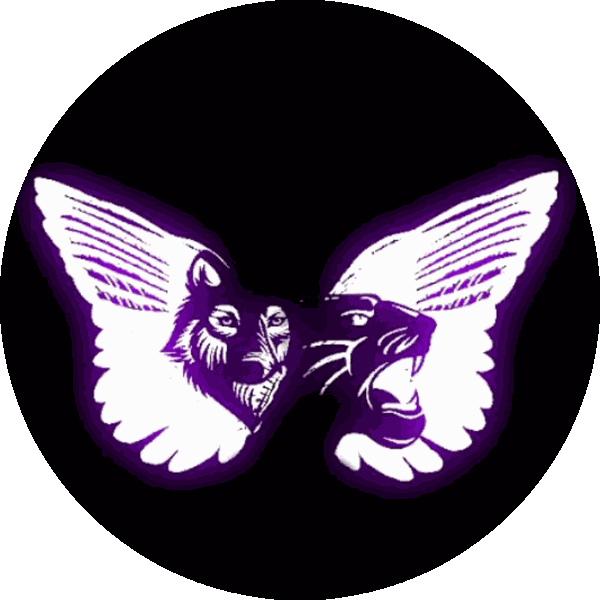
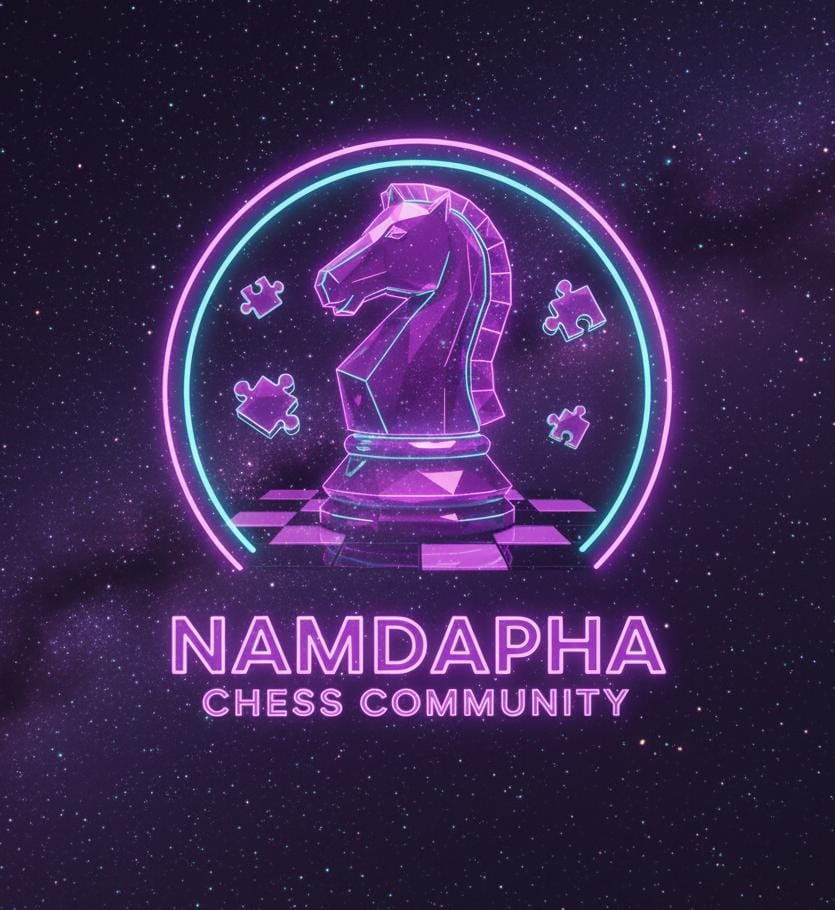

<!-- HERO -->

  

#  **NAMDAPHA HOUSE - General Student Body, IIT Madras**
### _Legacy • Leadership • Limitless_

<!-- MAIN LOGO -->

  

---

## 🌟 Quick Overview

**Namdapha House** fosters an inclusive ecosystem for students - balancing academic support, soft-skill growth, creative outlets, and competitive events.  
We run a set of curated communities, host events, maintain resource hubs, and prioritise wellbeing and development.

---

  

# 🎯 Our Vision & Mission

**Vision:** To create a thriving student ecosystem where everyone finds a space to learn, lead, and express.  
**Mission:** Curate high-quality communities, run meaningful events, maintain resources, and empower students to collaborate across disciplines.

**Core Values:**  
- Excellence & Integrity  
- Creativity & Curiosity  
- Collaboration & Accountability

---

# 📊 Snapshot — Impact & Stats

<!-- Replace stats with real numbers when available -->

  
  
  
  

---

# 📁 Get Involved - How to Join

- Join the **WhatsApp communities** for quick updates and event coordination.  
- Interested in tech collaboration? Apply to **Geek Squad** (links in Activities).

  
  &nbsp;

---

# 🧑‍💼 Upper House Council

<b>Team Leads & Contacts</b>

- **Secretary:** *Devansh Malhotra* - namdapha-sec@ds.study.iitm.ac.in  
- **Deputy Secretary:** *Sravya N* — namdapha-ds@ds.study.iitm.ac.in  
- **Web Admin:** *Harshita Dudeja* — namdapha-webad@ds.study.iitm.ac.in  

---

# 🧩 Activity Communities (Quick Access)
  
> Click any group for details.
>
> Join Namdapha Activities➕
 
 

<b>Show / Hide All Activities (11)</b>

<!-- Activities can be collapsed individually inside this big block or kept as brief links -->

   &nbsp;
   &nbsp;
   &nbsp;
   &nbsp;
   &nbsp;
   &nbsp;
   &nbsp;
   &nbsp;
   &nbsp;
   &nbsp;
  

---

### Short intros (click to expand for full details)

  
<b>The Podium - Debate</b>

  Debates • JAM • Public Speaking • Practice sessions

  
<b>Kavya - Poetry & Writing</b>

  Poetry nights • Storytelling • Open-mic

  
<b>Knights64</b>

  Tournaments • Puzzles • Coaching

  
<b>Firestorm - Free Fire</b>

  Casual & competitive gaming • Scrims

  
<b>Clanforge - Clash of Clans</b>

  Clan wars • Strategy • Base reviews

  
<b>The Battleground - BGMI</b>

  Scrims • Tournaments • Training

  
<b>Valorant Vanguards</b>

  Competitive Valorant • Team formation

  
<b>ElectroSphere - ES Students</b>

  ES-only study & community space

  
<b>Trivia Titans</b>

  Trivia nights • GK practice

  
<b>Geek Squad - Techies</b>

  Hackathons • Coding • Robotics • Team formation

  
<b>Pulse of Arts</b>

  Photography • Music • Dance • Art showcases

---

    
  

    
    &nbsp;
    
    &nbsp;
    
  

   
  ✨ Built with care • Namdapha House ✨

