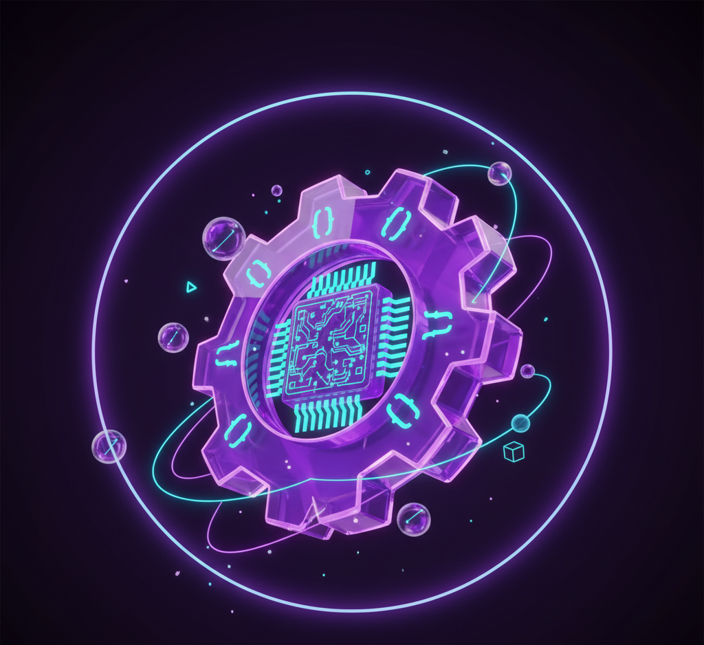

<div align="center">

<!-- ===================== FUTURISTIC HERO BANNER ===================== -->


<br><br>

# ✨ **NAMDAPHA HOUSE — OFFICIAL ACTIVITY HUB**
### _11 Communities • One Vision • Limitless Energy_


<!-- MAIN LOGO -->
<br>

<br><br>

</div>

---

# 🚀 **About Namdapha House**

Namdapha House is a vibrant, multidimensional ecosystem of **11 different activity communities**— designed to help students grow through creativity, competition, collaboration, wellness, artistic expression, gaming, and pure fun.

We operate entirely through **curated WhatsApp communities**, professionally moderated for quality, inclusivity, and engagement.

Our core belief:  
👉 _There is a space for **every** student in Namdapha._

---

<div align="center">

</div>

# 🧩 **THE 11 ACTIVITY COMMUNITIES**

Below are our official activity groups with their logos.  
Replace logos once uploaded.

---

## 🗣️ **1. The Podium (Debate)**  
<div align="center">
  <br>
  <sub><i>Where voices sharpen and leaders grow.</i></sub>
</div>

- Debates, JAMs, speeches  
- Communication mastery  
- Confidence-building  

<details>
  <summary><b>More About The Podium</b></summary>
  Debate drills, JAM practice, thought sparring sessions, speech warmups.
</details>

---

## ✍️ **2. Kavya (Poetry & Literature)**  
<div align="center">
  <br>
  <sub><i>A sanctuary for words, stories, and emotions.</i></sub>
</div>

- Poetry  
- Storytelling  
- Creative writing challenges  

---

## ♟️ **3. The Chessboard**  
<div align="center">
  <br>
  <sub><i>Think deeper. Play smarter.</i></sub>
</div>

- Tournaments  
- Daily puzzles  
- Strategy breakdowns  

---

## 🔥 **4. Firestorm (Free Fire)**  
<div align="center">
  
</div>

- Scrims  
- Squad events  
- Ranked rush  

---

## ⚔️ **5. Clanforge (Clash of Clans)**  
<div align="center">
  
</div>

- Clan wars  
- Base building  
- Attack strategy  

---

## 🎮 **6. The Battleground (BGMI)**  
<div align="center">
  
</div>

- BGMI scrims  
- Tournaments  
- Team coordination  

---

## 🎯 **7. Valorant Vanguards**  
<div align="center">
  
</div>

- Valorant ranked play  
- Tournaments  
- Team building  

---

## ⚡ **8. ElectroSphere (ES Only)**  
<div align="center">
  
</div>

- Exclusive ES student space  
- Study support  
- Bonding & activities  

---

## 🧠 **9. Trivia Titans**  
<div align="center">
  
</div>

- Trivia  
- Quiz practice  
- Fast-paced challenges  

---

## 🛠️ **10. Geek Squad (Techies)**  
<div align="center">
  
  <br><sub><i>A reserved circle for serious tech talent.</i></sub>
</div>

- Coding  
- Robotics  
- Hackathons  
- Team formation  

---

## 🎨 **11. Pulse of Arts**  
<div align="center">
  
</div>

- Dance  
- Music  
- Photography  
- Sketching  
- Creative showcases  

---

<div align="center">

</div>

# 🖥️ **Mission Log — Terminal Output**

```
> INITIALIZING NAMDAPHA SYSTEM...
> LOADING 11 ACTIVITY MODULES...
> STATUS: ONLINE
> MODE: COMMUNITY • COMPETITION • CREATIVITY
> READY FOR THE NEXT EVENT.
```

---

# 📁 **Sections**

<details><summary><b>Core Team</b></summary>
Meet the minds behind Namdapha House.
</details>

<details><summary><b>Events Archive</b></summary>
Posters, winners, previous events, achievements.
</details>

<details><summary><b>Resource Hub</b></summary>
Notes, templates, tools, and community documents.
</details>

<details><summary><b>FAQs</b></summary>
Common questions answered here.
</details>

---

# 🌐 **Connect With Us**

<div align="center">

[]()
[]()
[]()

</div>

---

<div align="center">

<br>
✨ _Made with ♥ by Namdapha House_ ✨
</div>

